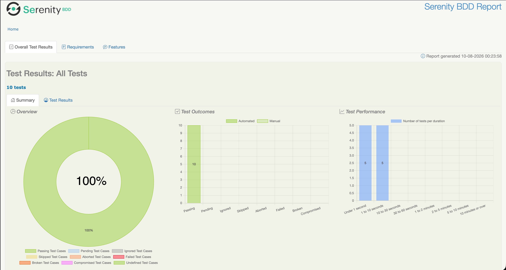
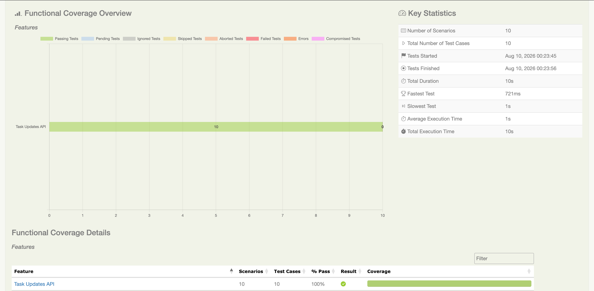
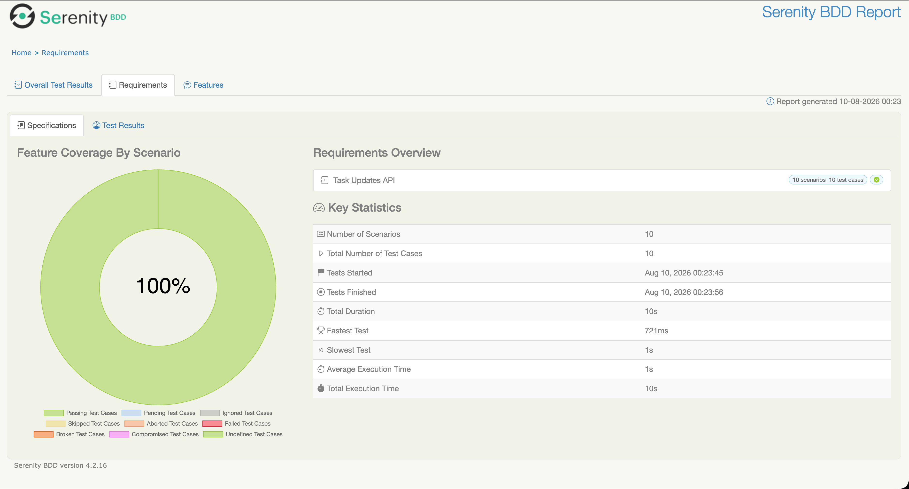

# 🚀 API Testing Framework — Rest Assured + Cucumber + Serenity

> A production-grade API automation framework built using **Java, Rest Assured, Cucumber BDD, JUnit 5, Serenity BDD, Jackson, Lombok, AssertJ, Java Faker and Maven**.

This project demonstrates a scalable API automation architecture with clear separation of:

- BDD specifications
- Step definitions
- Scenario state
- API clients
- Request/response models
- Test-data factories
- Configuration
- Assertions
- Reporting

---

## 📊 Test Execution & Serenity Report

The framework executes the Task Updates API test suite and generates a detailed Serenity BDD report.

### Serenity BDD Report





##  Key Features

- ✅ REST API automation using Rest Assured
- ✅ Behavior Driven Development using Cucumber + Gherkin
- ✅ JUnit 5 execution engine
- ✅ Serenity BDD reporting
- ✅ Builder Pattern for request models
- ✅ Lombok-powered POJOs
- ✅ Jackson serialization/deserialization
- ✅ Java Faker for dynamic test data
- ✅ AssertJ fluent assertions
- ✅ Centralized configuration
- ✅ Reusable API Client architecture
- ✅ Scenario-level state management
- ✅ Positive API testing
- ✅ Negative API testing
- ✅ CRUD API coverage
- ✅ PUT and PATCH coverage
- ✅ HTTP status-code validation
- ✅ Response-body validation
- ✅ Request/response logging
- ✅ Maven-based execution
- ✅ Clean separation of framework responsibilities

---

# Framework Architecture

```text
                         ┌───────────────────────┐
                         │       Gherkin         │
                         │     Feature Files     │
                         └───────────┬───────────┘
                                     │
                                     ▼
                         ┌───────────────────────┐
                         │   Step Definitions    │
                         │      Cucumber         │
                         └───────────┬───────────┘
                                     │
                                     ▼
                         ┌───────────────────────┐
                         │   Scenario Context    │
                         │    Scenario State     │
                         └───────────┬───────────┘
                                     │
                                     ▼
                         ┌───────────────────────┐
                         │      API Client       │
                         │     TicketClient      │
                         └───────────┬───────────┘
                                     │
                                     ▼
                         ┌───────────────────────┐
                         │      Base Client      │
                         │ Request Specification │
                         │ Response Specification│
                         └───────────┬───────────┘
                                     │
                                     ▼
                         ┌───────────────────────┐
                         │     Rest Assured      │
                         └───────────┬───────────┘
                                     │
                                     ▼
                         ┌───────────────────────┐
                         │       ReqRes API      │
                         └───────────────────────┘

                                     │
                                     ▼
                         ┌───────────────────────┐
                         │      Serenity BDD     │
                         │       Reporting       │
                         └───────────────────────┘


```


## 🛠️ Technology Stack

| Technology   | Purpose                            |
|--------------|------------------------------------|
| Java 17      | Programming language               |
| Rest Assured | REST API automation                |
| Cucumber     | BDD / Gherkin                      |
| JUnit 5      | Test execution                     |
| Serenity BDD | Test reporting                     |
| Jackson      | JSON serialization/deserialization |
| Lombok       | Boilerplate reduction              |
| AssertJ      | Fluent assertions                  |
| Java Faker   | Dynamic test data                  |
| Maven        | Dependency and build management    |
| ReqRes       | API under test                     |

## 👨‍💻 Author
**Tanishq Arora ->
QA Automation Engineer | SDET | AI - Versed**


Areas of focus:

API Automation,
UI Automation.
Mobile Automation,
BDD,
Test Framework Architecture,
CI/CD.
Quality Engineering,
Performance Testing